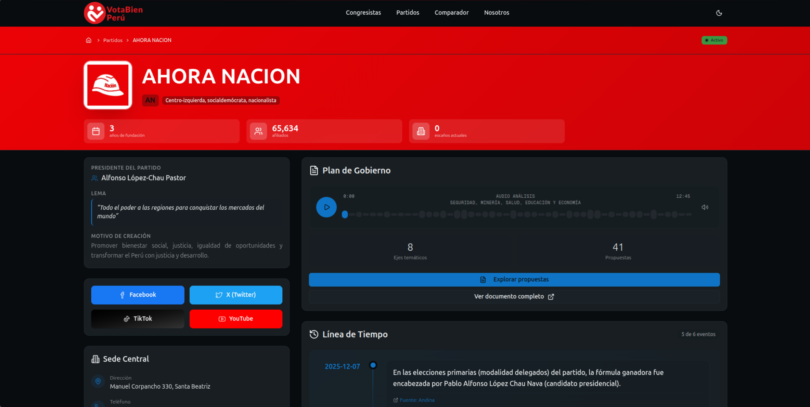

<a name="readme-top"></a>

<div align="center">

[![Contributors][contributors-shield]][contributors-url]
[![Forks][forks-shield]][forks-url]
[![Stargazers][stars-shield]][stars-url]
[![Issues][issues-shield]][issues-url]

<a href="https://votabien.pe/" target="_blank" rel="noopener noreferrer">
  
</a>

## Plataforma de transparencia política para una ciudadanía informada

Empoderando a los peruanos con información verificable sobre sus representantes políticos

[Ver Demo](https://votabien-peru-git-main-antguivy.vercel.app/) · [Reportar error](https://github.com/antguivy/votabien-peru/issues) · [Sugerir algo](https://github.com/antguivy/votabien-peru/issues)

</div>

<details>
<summary>Tabla de contenidos</summary>

- [Plataforma de transparencia política para una ciudadanía informada](#plataforma-de-transparencia-política-para-una-ciudadanía-informada)
- [Sobre el Proyecto](#-sobre-el-proyecto)
  - [Capturas de pantalla](#capturas-de-pantalla)
- [Características principales](#-características-principales)
- [Tech Stack](#-tech-stack)
- [Para empezar](#-para-empezar)
  - [Prerequisitos](#prerequisitos)
  - [Instalación](#instalación)
- [Estructura del Proyecto](#️-estructura-del-proyecto)
- [Contribuir al proyecto](#-contribuir-al-proyecto)
- [Roadmap](#️-roadmap)
- [Repositorios Relacionados](#-repositorios-relacionados)

</details>

## Sobre el Proyecto

**VotaBien Perú** es una iniciativa de código abierto que democratiza el acceso a la información política en el Perú. Nuestra plataforma permite a los ciudadanos peruanos explorar de manera transparente los perfiles de congresistas actuales y futuros candidatos, realizar seguimiento a su actividad legislativa, y tomar decisiones informadas basadas en datos verificables.

Este proyecto nace con la visión de empoderar a la ciudadanía con información clara, accesible y verificable sobre quiénes nos representan y quiénes aspiran a hacerlo.

### Capturas de pantalla



<p align="right">(<a href="#readme-top">volver arriba</a>)</p>

## Características principales

- **Búsqueda Inteligente** - Encuentra rápidamente congresistas y candidatos con filtros avanzados por nombre, región, partido
- **Perfiles Detallados** - Información completa sobre trayectoria política, experiencia de traba, proyectos de ley, antecedentes y otros
- **Diseño Responsivo** - Experiencia optimizada en todos los dispositivos con UI moderna
- **Alto Rendimiento** - Optimizado con Next.js 15 App Router y Server Components
- **Calidad de Código** - Validación estricta con ESLint, Prettier, Commitlint y TypeScript
- **Código Abierto** - Transparente y verificable por la comunidad

<p align="right">(<a href="#readme-top">volver arriba</a>)</p>

### Instalación

> El proyecto se conecta directamente a nuestro entorno de **Staging** en Supabase.

1. Clona el repositorio

   ```sh
   git clone https://github.com/antguivy/votabien-peru.git
   cd votabien-peru
   ```

2. Instala los paquetes

   ```sh
   pnpm install
   ```

   Esto configurará automáticamente los hooks de git (Lefthook).

3. Configura el entorno

   Copia el archivo de ejemplo. Este archivo ya contiene las claves públicas de Staging necesarias.

   ```sh
   cp .env.example .env.local
   ```

4. Ejecuta el proyecto

   ```sh
   pnpm dev
   ```

   Visita http://localhost:3000 para ver la aplicación.

### Scripts Disponibles

```sh
pnpm dev          # Servidor de desarrollo
pnpm lint         # Verificar código
pnpm type-check   # Verificar tipos de TypeScript
pnpm commit       # Realizar commit de forma interactiva
```

<p align="right">(<a href="#readme-top">volver arriba</a>)</p>

## 🏗️ Estructura del Proyecto

```
votabien-peru/
├── app/                    # App Router de Next.js 15
│   ├── (platform)/        # Rutas principales de la plataforma
│   ├── auth/              # Rutas de autenticación
│   └── api/               # API Routes
├── components/            # Componentes React
│   ├── ui/               # Componentes de Shadcn/ui
│   └── ...               # Componentes específicos del dominio
├── hooks/                 # Custom React Hooks
├── interfaces/            # TypeScript Interfaces y Types
├── lib/                   # Utilidades y configuración
│   ├── supabase/         # Cliente de Supabase
│   └── utils.ts          # Funciones auxiliares
├── public/               # Archivos estáticos (imágenes, fonts)
├── queries/              # Queries de Supabase
└── schemas/              # Schemas de validación (Zod)
```

<p align="right">(<a href="#readme-top">volver arriba</a>)</p>

## Contribuir al proyecto

Las contribuciones son lo que hacen que la comunidad de código abierto sea un lugar increíble para aprender, inspirar y crear. ¡Cualquier contribución que hagas es **muy apreciada**!

Si tienes alguna sugerencia que podría mejorar el proyecto, por favor haz un [_fork_](https://github.com/antguivy/votabien-peru/fork) del repositorio y crea una [_pull request_](https://github.com/antguivy/votabien-peru/pulls). También puedes simplemente abrir un [_issue_](https://github.com/antguivy/votabien-peru/issues) con la etiqueta "enhancement".

Aquí tienes una guía rápida:

1. Haz un [_fork_](https://github.com/antguivy/votabien-peru/fork) del Proyecto
2. Clona tu [_fork_](https://github.com/antguivy/votabien-peru/fork) (`git clone <URL del fork>`)
3. Añade el repositorio original como remoto (`git remote add upstream <URL del repositorio original>`)
4. Crea tu Rama de Funcionalidad (`git switch -c feat/CaracteristicaNueva`)
5. Realiza tus Cambios (`git commit -m 'feat: alguna característica nueva'`)
6. Haz Push a la Rama (`git push origin feat/CaracteristicaNueva`)
7. Abre una [_pull request_](https://github.com/antguivy/votabien-peru/pulls)

Por favor, consulta nuestra [guía de contribución](https://github.com/antguivy/votabien-peru/blob/main/CONTRIBUTING.md) para saber cómo puedes empezar de la mejor manera y siguiendo [buenas prácticas](https://github.com/antguivy/votabien-peru/blob/main/CONTRIBUTING.md#buenas-prácticas-).

**¡Gracias a todos los colaboradores que han hecho posible este proyecto!**

[](https://github.com/antguivy/votabien-peru/graphs/contributors)

<p align="right">(<a href="#readme-top">volver arriba</a>)</p>

## Roadmap

- [x] Estructura base del proyecto
- [x] Migración SDK Supabase
- [x] Sistema de búsqueda de legisladores(congresistas)
- [x] Sistema de búsqueda de candidatos
- [x] Sistema de comparación de legisladores(congresistas)
- [x] Gestión de legisladores(congresistas)
- [x] Gestión de partidos
- [x] PWA
- [ ] Sistema de comparación de candidatos
- [ ] Notificaciones de actividad legislativa

Consulta los [issues abiertos](https://github.com/antguivy/votabien-peru/issues) para ver una lista completa de características propuestas y problemas conocidos.

<p align="right">(<a href="#readme-top">volver arriba</a>)</p>

## Tech Stack

- [![Next.js][nextjs-badge]][nextjs-url] - The React Framework for Production
- [![React][react-badge]][react-url] - A JavaScript library for building user interfaces
- [![TypeScript][typescript-badge]][typescript-url] - JavaScript with syntax for types
- [![Tailwind CSS][tailwind-badge]][tailwind-url] - A utility-first CSS framework
- [![Shadcn/ui][shadcn-badge]][shadcn-url] - Re-usable components built with Radix UI
- [![Supabase][supabase-badge]][supabase-url] - Open source Firebase alternative
- [![pnpm][pnpm-badge]][pnpm-url] - Fast, disk space efficient package manager

<p align="right">(<a href="#readme-top">volver arriba</a>)</p>

---

<div align="center">

</div>

<!-- MARKDOWN LINKS & IMAGES -->

[contributors-shield]: https://img.shields.io/github/contributors/antguivy/votabien-peru.svg?style=for-the-badge
[contributors-url]: https://github.com/antguivy/votabien-peru/graphs/contributors
[forks-shield]: https://img.shields.io/github/forks/antguivy/votabien-peru.svg?style=for-the-badge
[forks-url]: https://github.com/antguivy/votabien-peru/network/members
[stars-shield]: https://img.shields.io/github/stars/antguivy/votabien-peru.svg?style=for-the-badge
[stars-url]: https://github.com/antguivy/votabien-peru/stargazers
[issues-shield]: https://img.shields.io/github/issues/antguivy/votabien-peru.svg?style=for-the-badge
[issues-url]: https://github.com/antguivy/votabien-peru/issues
[license-shield]: https://img.shields.io/github/license/antguivy/votabien-peru.svg?style=for-the-badge
[license-url]: https://github.com/antguivy/votabien-peru/blob/main/LICENSE
[nextjs-badge]: https://img.shields.io/badge/Next.js-000000?style=for-the-badge&logo=nextdotjs&logoColor=white
[nextjs-url]: https://nextjs.org/
[react-badge]: https://img.shields.io/badge/React-61DAFB?style=for-the-badge&logo=react&logoColor=black
[react-url]: https://reactjs.org/
[typescript-badge]: https://img.shields.io/badge/TypeScript-3178C6?style=for-the-badge&logo=typescript&logoColor=white
[typescript-url]: https://www.typescriptlang.org/
[tailwind-badge]: https://img.shields.io/badge/Tailwind_CSS-38B2AC?style=for-the-badge&logo=tailwind-css&logoColor=white
[tailwind-url]: https://tailwindcss.com/
[shadcn-badge]: https://img.shields.io/badge/shadcn/ui-000000?style=for-the-badge&logo=shadcnui&logoColor=white
[shadcn-url]: https://ui.shadcn.com/
[supabase-badge]: https://img.shields.io/badge/Supabase-3ECF8E?style=for-the-badge&logo=supabase&logoColor=white
[supabase-url]: https://supabase.com/
[pnpm-badge]: https://img.shields.io/badge/pnpm-F69220?style=for-the-badge&logo=pnpm&logoColor=white
[pnpm-url]: https://pnpm.io/
